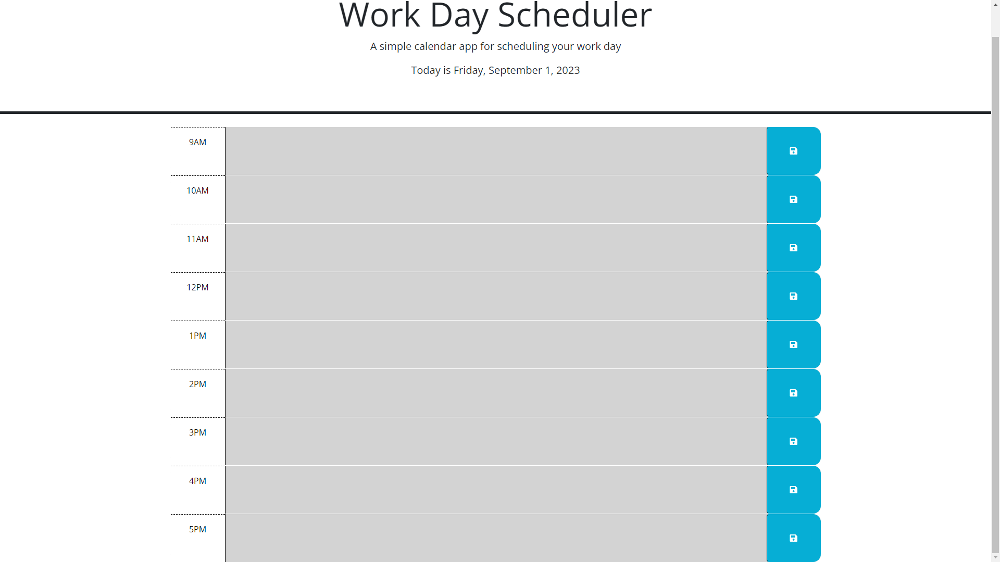

# Work-Planner

[Webpage](https://drbubblez.github.io/Work-Planner/)

## Table of Contents
- [Preview](#preview)
- [Description](#description)
- [Usage](#usage)
- [Technologies](#technologies)
- [License](#license)

## Preview



## Description

```
This is a simple work planner that allows the user to save events for each
hour of the working day. The current day is displayed at the top of the calendar.
Each hour is color-coded to indicate whether it is in the past, present, or future.
```

## Usage

```
The user can enter events into the text area for each hour of the working day.
The user can then save the event by clicking the save button. The event will be
saved to local storage and will persist on the page even if the page is refreshed.
```

## Technologies

```
- HTML
- CSS
- JavaScript
- jQuery
- Day.JS
```

## License

```
This project is licensed under the MIT License.
```
